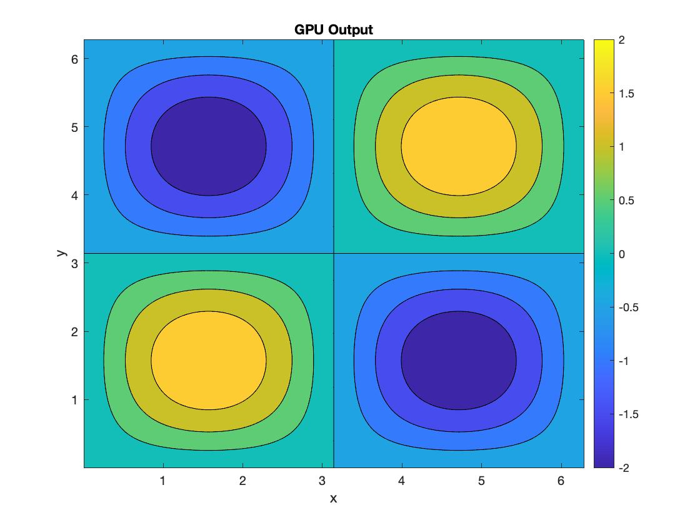

# README

## Usage Instructions

### Installing / Getting started
```shell
git clone https://github.com/vzendejasl/2d-incompressible-NS-solver-cuda.git
```

### Installation Requirements
The following support modules (or newer) are required to run the code,

1. gcc version 5.0.0 
2. cmake version 3.9.1 
3. nvcc 9.1 (Nvidia toolkit)

The Nvidia toolkit can be downloaded from https://developer.nvidia.com/cuda-toolkit.
You can check your cmake version and gcc version with

```shell
gcc --version
vcc --version
```
### Building
To compile, in the `232aCFDCode_CUDA` directory, simply run
```shell
mkdir build
cd build
```

If you are degguing/adding new features to the code then,
```shell
cmake -DCMAKE_BUILD_TYPE=Debug ../
```
otherwise,
```shell
cmake -DCMAKE_BUILD_TYPE=Release ../
```
and finally
```shell
cmake --build .
```
### Running
Once the makefile is created in the `build` directory,

```shell
make 
```
and you will see the executable `2dSolverNS`. 

To run the code run, type
```shell
./2dSolverNS
```
You should see the following output in your terminal,

```shell
Running CPU Code...
Iteration # 0
Iteration # 1
Iteration # 2
Iteration # 3
Iteration # 4
Time taken by CPU: 20680 milliseconds
---------------------------------
Running GPU Code...
Iteration # 0
Iteration # 1
Iteration # 2
Iteration # 3
Iteration # 4
Time taken by GPU: 788 milliseconds
```

You can control the number of time steps taken by the code by modifying `int num_iter = 5;` with a larger value in `main.cpp`.

### Visualization
You should see two text files in the same directory as `2dSolverNS`, `CPU_output.txt` and `GPU_output.txt`. These text files are the CPU and GPU solutions (for the curl of the velocity field given by U(x,y) and V(x,y)) at the final time step. In the main directory you will find a MATLAB script titled `PlotOutput.m`. You can run the script as you would any other MATLAB program with the exception that the number of grid points needs to be specified and needs to match the number of grid points used in the calculations.

## Project Description

### (1) Summary

The two-dimensional (2D), incompressible Navier-Stokes (N-S) equations represent the conservation of momentum for Newtonian fluids where compressible effects are neglected. The 2D N-S equations are useful for a wide range of physical phenomena and engineering applications ranging from atmospheric modeling to simulating blood flow. In this project, we use a staggered second-order central finite-difference method to discretize space and a third-order Runge-Kutta time advancement scheme to march in time, along with a fractional step method for enforcing the incompressibility constraint. This code had already been implemented in MATLAB previously (from the Ae232a course which both authors have taken), and in this project, this code was converted to C++ and then to CUDA, to improve the computational efficiency of the solver.

### (2) Background Information

In this project, a computational fluid dynamics (CFD) code is implemented to solve the two-dimensional (2D), incompressible Navier-Stokes (N-S) equations in a periodic domain. A staggered second-order central finite-difference scheme is used to solve the governing equations spatially, and a third-order Runge-Kutta (RK3) scheme is used to solve the equations temporally. A fractional step method is implemented to satisfy the incompressibility constraint of the governing N-S equations.

#### (2.1) Governing Equations and Boundary Conditions

In this code, the x and y directions are chosen to have an extent of 2πLx and 2πLy respectively. All lengths are normalized by Lx, all velocities are normalized by a reference speed U0, and all times are normalized by Lx/U0. Nx and Ny uniformly distributed grid points are used to discretize the spatial domain.

The resulting non-dimensional, incompressible, Navier-Stokes (N-S) equations that are solved using this code are given as follows:

) (2.1)

) (2.2)

Here, u and v are the normalized velocities in the x and y directions respectively, p is the pressure, Re = U0Lx/ν is the Reynolds number, and ν is the kinematic viscosity. 

The boundary conditions are chosen to be periodic, such that the first grid point, 1, is adjacent to points 2 and Nx, and similarly the last grid point, Nx, is adjacent to points 1 and Nx − 1. This periodic boundary condition is applied for both the x and y directions. 

#### (2.2) Time Advancement

For this code, a third-order Runge-Kutta (RK3) scheme is used to integrate the governing equations in time. The RK3 scheme for an arbitrary function evaluation, f (x, y) at a point (xi, yi) is given by:

)

)

)

&space;=&space;y(x)&space;&plus;&space;\frac{1}{6}\left(&space;K_1&space;&plus;&space;4K_2&space;&plus;&space;K_3&space;&space;\right)) (2.3)

#### (2.3) Spatial Discretization

To solve the governing equations spatially, a staggered second-order central finite-difference method is used. The u-components of the velocity field are stored on the x-faces of the grid, and the v-components of the velocity field are stored on the y-faces of the grid. Scalar values such as pressure, p, are stored in grid cell centers.

Due to the staggered grid, it is necessary to interpolate certain terms in the right-hand sides of the discretized governing N-S equations. The right-hand sides of the discretized governing momentum equations are given below. For the u-momentum equation, all terms are interpolated to be computed at the x-faces where the u values are stored, and similarly all terms in the v-momentum equation are interpolated to be computed at the y-faces where the v values are stored. 

U-Momentum RHS:

  ) (2.4)

V-Momentum RHS:

) (2.5)

For the diffusion terms in the equations above, no interpolation is necessary, and each of these terms are computed directly using a second-order central finite difference as follows:

 (2.6)

 (2.7)

 (2.8)

 (2.9)

where ∆x and ∆y are the grid spacings in the x and y directions respectively.

For the convective terms δuu/δx and δvv/δy, a second-order central finite difference scheme is applied as follows:

&space;&space;&space;&space;=&space;&space;&space;&space;\frac{1}{2&space;\Delta&space;x}(u_{i&plus;1,j}^2-u_{i-1,j}^2)) (2.10)

&space;&space;&space;&space;=&space;&space;&space;&space;\frac{1}{2&space;\Delta&space;y}(v_{i,j&plus;1}^2&space;-&space;v_{i,j-1}^2)) (2.11)

Finally, for the mixed convective terms δuv/δy and δuv/δx, the following interpolations are used: 

&space;&space;&space;&space;(u_{i,j&plus;1}&plus;u_{i,j})&space;&space;&space;&space;-&space;&space;&space;&space;(v_{i,j}&plus;v_{i-1,j})&space;&space;&space;&space;(u_{i,j}&plus;u_{i,j-1})&space;&space;&space;&space;)) (2.12)

&space;&space;&space;&space;(v_{i&plus;1,j}&plus;v_{i,j})&space;&space;&space;&space;-&space;&space;&space;&space;(u_{i,j}&plus;u_{i,j-1})&space;&space;&space;&space;(v_{i,j}&plus;v_{i-1,j})&space;&space;&space;&space;)) (2.13)

#### (2.4) Fractional Step (Projection) Method and Poisson Solver

For this code, a fractional step/ projection method is used to uncouple the pressure solution in the governing incompressible Navier-Stokes equations, while still satisfying the incompressibility/ divergence-free constraint. For each of the 3 “substeps” in the RK3 scheme, the right-hand side equations give the intermediate velocities un and vn. However, since (2.4) and (2.5) do not enforce any incompressibility constraints, there is no restriction that forces the flowfield solution given by un* and vn* to be divergence free. In order to ensure that the resulting flowfield is divergence free, the pseudo-pressure, p, is defined in order to update the values of un* and vn* to satisfy continuity: 

 (2.14)

 (2.15)

This pseudo-pressure can be computed via the Poisson equation as: 

/\Delta&space;t\equiv&space;f) (2.16)

In summary, by solving (2.4) and (2.5) to get the intermediate solutions un* and vn*, then computing the pseudo-pressure by solving (2.16), then finally computing the divergence free solutions un+1 and vn+1 at each substep of the RK3 scheme, it is ensured that the resulting flowfield satisfies continuity. 

To solve the Poisson equation given by (2.16), the method of Fourier transforms is used with the corresponding modified wavenumbers of the second-order central finite difference scheme. Taking the Fourier transform of (2.16) we have:

&space;\hat{p}&space;=&space;\hat{f}&space;&space;&space;&space;\implies&space;&space;&space;&space;\hat{p}&space;&space;&space;&space;=&space;&space;&space;&space;\frac{-1}{k_x^{'2}&plus;k_y^{'2}}&space;\hat{f}) (2.17)

where kx′ and ky′ are the modified wave numbers in the x and y directions respectively. kx′ and ky′ for the second-order central finite difference can be computed as follows:

}) (2.18)

### (3) Implementation (description of files in src directory)

For this project, the implementation of the code described in the previous section has been split into several files. The implementations of the code functions can be found in the src directory. For all file names with both a .cpp and .cu function, the .cpp file corresponds to a serial C++ implementation, whereas the .cu file corresponds to the parallel CUDA implementation.

The RK3 time integration scheme described above has been implemented in the files "time_advance_RK3.cpp" and "time_advance_RK3.cu". For the CUDA version of the code, a speed up was performed by using the cublas library function, cublasDgeam, to perform all of the corresponding matrix operations for the RK3 substeps. This allowed for a much faster computation of the corresponding matrices that were passed to the RHS solver and pressure/ projection step solver for each substep of the RK3 time integration.

The spatial solver has been implemented in the files "compute_RHS.cpp" and "compute_RHS.cu". The CUDA version of the RHS solver was sped up by using a CUDA kernel call to the computeRHS function such that the RHS computation could be done in parallel. This allowed for a much faster implementation for the spatial solver when compared to the serial C++ implementation with a standard double for loop across all (x,y) grid points.

The projection step/ fractional step method has been implemented in the files "compute_projection_step.cpp" and "compute_projection_step.cu". The CUDA version of the projection step solver was implemented using kernel calls for each of the key steps in the computation, i.e. fftshift and P calculation in the frequency domain, as well as by using the cuFFT library for the 2D FFT and IFFT operations. This implementation allowed for a much more efficient implementation of the FFT operations performed in the pressure/ projection step solver for the CUDA version of the code. It should be noted that for the .cpp version of this function, the 2D FFT code was adapted from the following source: http://paulbourke.net/miscellaneous/dft/. Additionally, the fftshift function for the CUDA code was adapted from: https://forums.developer.nvidia.com/t/does-cuda-provide-fftshift-function-like-matlab/26102.

The curl function for computing the curl of a resulting U(x,y), V(x,y) flowfield has been implemented in "compute_curl.cpp". No CUDA versions of this function were implemented as this function just gets called once for post-processing/ plotting after the time integration is complete for the solver, and so a CUDA implementation of this function would not contribute to a significant speed up in the runtime of the code.

The main file that sets the initial conditions of U(x,y), V(x,y) for a given problem and then runs the solver by making calls to the above functions has been implmented in "main.cpp".

Finally, some additional helper functions and setup files for running the code have been implemented in the files "cuda_header.cuh", "cuda_helper.cuh", "helper_functions.cpp", as well as in "functionsCalls.h", "functionCalls.h.gch", and "variableCalls.h" in the include directory.

## Results
The analytical solution to the 2D Taylor-Green vortex for the incompressible N-S equations are given by:

cos(y)e^{-2t/Re}) 

sin(y)e^{-2t/Re})

This is the test case chosen to validate the GPU code against the CPU version for this project. An output of the corresponding curl solution (computed from the final solutions of the velocity field given by U(x,y) and V(x,y)) is shown below where `NX = NY = 2048` after 10 iterations. In this simulation, the velocity field is initialized using the analytical solution given by the equations above, and the CFD code evolves these velocity fields in time. As mentioned in the usage instructions section previously, these plots can be generated from the CPU/ GPU output text files "CPU_output.txt" and "GPU_output.txt" respectively, and then plotted using the MATLAB function "PlotOutput.m".




## Performance Analysis

Running all three implementations of the code (MATLAB, C++, CUDA) for the 2D Taylor-Green Vortex case described previously, we see that there is a significant speed-up of the code (as expected) for the parallel CUDA implementation vs. the serial MATLAB and C++ implementations. More specifically, for a run of the code with 50 timesteps, we find that the MATLAB implementation runs in 186702ms, the C++ implementation runs in 207404ms, and the CUDA implementation runs in 4350ms. This corresponds to a 42.92x speed up in the code for the CUDA version over the original MATLAB implementation, and an even greater 47.68x speed up of the CUDA version over the serial C++ implementation.

Despite the success of the CUDA version of the code in speeding up the CFD computation, there are still some things that could be further improved. The primary point of improvement in the current CUDA implementation would be to better optimize the number of blocks and threads per block arguments used in the kernel calls throughout the code. In the current implementation, the “standard” values from the HW problems of 1024,32 are used, but these parameters could be better optimized based on the grid/ domain size for a given problem that is being solved.

Additionally, to speed up the kernel calls even further, more optimizations such as those discussed for lab 3 in the context of parallel reduction may be useful for our code (e.g. loop unrolling).
